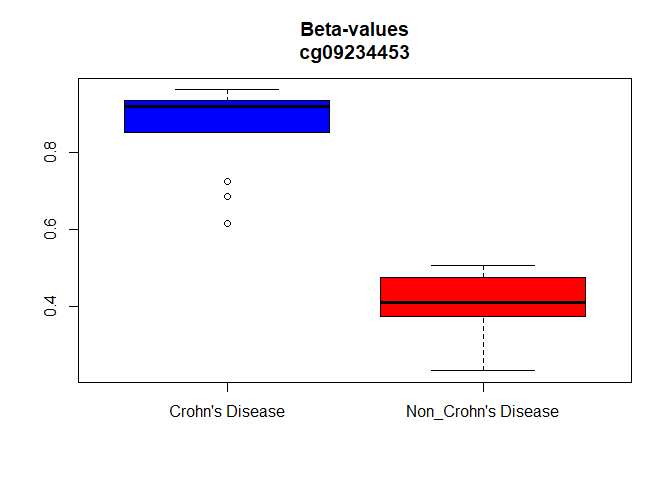
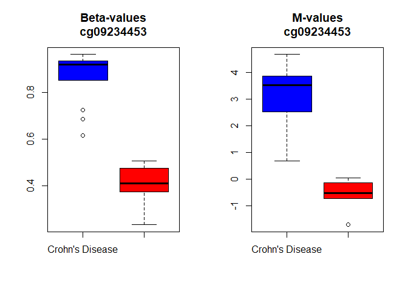
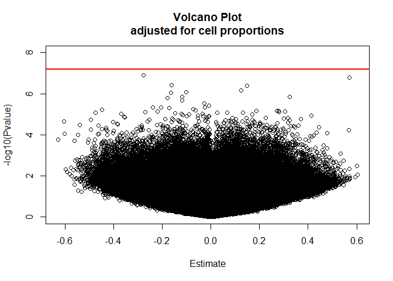
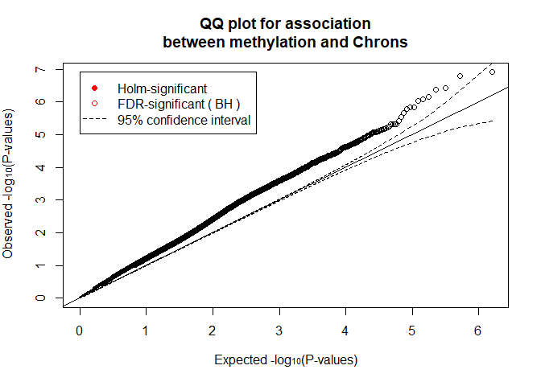
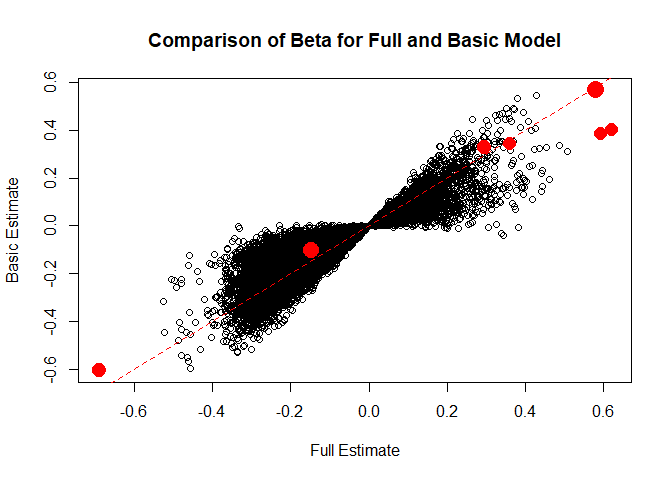
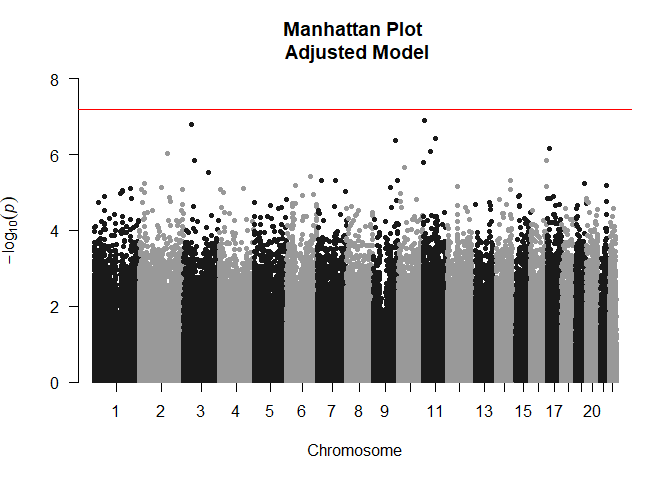
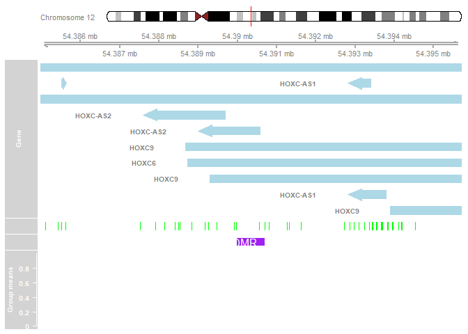

# Chron's Disease EWAS Using Illumina EPIC Data

Script for performing an EWAS of Chron's disease in fibroblast cell samples. Data is from a [fibroblast EWAS](https://www.ncbi.nlm.nih.gov/pubmed/30589872)

This project looks at DNA methylation data from the EPIC arrray and provides an example analysis using publicly available samples from fibroblast samples (GSE99788). 

To begin the [GitHub repo](https://github.com/CavinWard/methyl_course/edit/master/README.md) and run the R script 'EPIC EWAS Example Package Install v1.R' which is in the R_code file. This will install the packages needed for the analysis. All packages should install with no errors (though some may have warnings, particuarly about the R version being used). This has been tested with R v3.5.1 with no errors. Though some older versions of these packages may need to be manually deleted before they will install properly. Calling the library('packagename') command can test if the packages installed properly.

You will then need to download the pre-processed methylation data files which are available at this [link](https://drive.google.com/open?id=1OKLguigp0jfz5ljRLeV_MEbrCHSjFLV6).


```r
rm(list=ls())

#### will need to alter this section to set the working directory to be the directory containing the data
home=TRUE
if(home)
{
  setwd("C:/Users/cavin/Desktop/methyl_course/")
} else
{
  setwd("M:/Methyl Course/methyl_course/")
}

#' load packages and data
library(minfi)
```

```
## Warning: package 'minfi' was built under R version 3.5.2
```

```
## Warning: package 'matrixStats' was built under R version 3.5.2
```

```
## Warning: package 'BiocParallel' was built under R version 3.5.2
```

```
## Warning: package 'foreach' was built under R version 3.5.2
```

```
## Warning: package 'iterators' was built under R version 3.5.2
```

```
## Warning: package 'locfit' was built under R version 3.5.2
```

```r
load("GSE99788_Data/Processed Data/WB.noob.RData") # phenotype data
dim(WB.noob)
```

```
## [1] 858600     18
```

```r
load("GSE99788_Data/Processed Data/betas.rcp.RData") # processed betas
load("GSE99788_Data/Processed Data/Gbeta.RData") # annotation file

suppressPackageStartupMessages({
  library(CpGassoc) # for running association analysis between methylation levels values and phenotype of interest
  library(data.table) # for fast aggregation of large data 
  library(qqman) # for visualization of data
  library(IlluminaHumanMethylationEPICanno.ilm10b2.hg19) # for annotation for Illumina's EPIC methylation arrays
  library(bumphunter) # for regional analysis 
  library(DMRcate)
  library(MASS) # for basic statistics
  library(sandwich) # for linear regression (robust sandwich variance estimator)
  library(lmtest) # for testing Linear Regression Models
  library(stringi) # string manipulation
  library(knitr) # prints prettily
})
```

```
## Warning: package 'CpGassoc' was built under R version 3.5.3
```

```
## Warning: package 'qqman' was built under R version 3.5.3
```

```
## Warning: package 'sandwich' was built under R version 3.5.3
```

```
## Warning: package 'lmtest' was built under R version 3.5.3
```

First set up the phenotypes

```r
pheno = data.frame(pData(WB.noob))
pheno = pheno[,c("geo_accession","disease_state","gender","age","chip")]
pheno$disease_state <- factor(pheno$disease_state)
pheno$chip <- factor(pheno$chip)
pheno$gender <- factor(pheno$gender)
rownames(pheno) <- pheno$geo_accession
pheno <- pheno[,-1] #### remove geo_accession column, is now the rownames
### can remove WB.noob now as don't need phenotype info
rm(WB.noob)
```


#### Let's take a quick look at the balance of disease_sate across the chips


```r
table(pheno[,c("chip","disease_state")])
```

```
##               disease_state
## chip           Crohn's Disease Non_Crohn's Disease
##   200325570033               4                   2
##   200325570057               4                   3
##   200325570122               5                   0
```

Now Remove snp and non CpG probes


```r
betas.clean = rmSNPandCH(betas.rcp,  mafcut = 0.05, and = TRUE, rmcrosshyb = TRUE, rmXY= TRUE)
nCpG = dim(betas.clean)[1]
nCpG
```

```
## [1] 788843
```

```r
rm(betas.rcp)
```

#### First let's look at one CpG (cg09234453)

```r
CpG.name = "cg09234453"
CpG.level <- betas.clean[CpG.name,]

knitr::kable(cbind(Min   = round( tapply(CpG.level,pheno$disease_state,min   ),3),
                   Mean  = round( tapply(CpG.level,pheno$disease_state,mean  ),3), 
                   Median= round( tapply(CpG.level,pheno$disease_state,median),3),
                   Max   = round( tapply(CpG.level,pheno$disease_state,max   ),3),
                   SD    = round( tapply(CpG.level,pheno$disease_state,sd    ),3),
                   N     = table( pheno$disease_state )))
```

                         Min    Mean   Median     Max      SD    N
--------------------  ------  ------  -------  ------  ------  ---
Crohn's Disease        0.616   0.868     0.92   0.962   0.115   13
Non_Crohn's Disease    0.233   0.400     0.41   0.506   0.107    5

```r
# Now let's examine boxplot by disease state
par(mfrow=c(1,1))
boxplot(CpG.level ~ pheno$disease_state, main=paste0("Beta-values\n", CpG.name), col=c("blue","red"))
```



A quick linear regression on the beta values

```r
#' linear regression on betas
summary(lm(CpG.level~pheno$disease_state))$coefficients[2,c("Estimate", "Pr(>|t|)","Std. Error")]
```

```
##      Estimate      Pr(>|t|)    Std. Error 
## -4.684073e-01  6.839806e-07  5.950831e-02
```


#### Now take a look at M-values for the same CpG

```r
CpG.mlevel = log2(CpG.level/(1-CpG.level))

knitr::kable(cbind(Min    = round( tapply(CpG.mlevel, pheno$disease_state,min   ),3),
                   Mean   = round( tapply(CpG.mlevel, pheno$disease_state,mean  ),3), 
                   Median = round( tapply(CpG.mlevel, pheno$disease_state,median),3),
                   Max    = round( tapply(CpG.mlevel, pheno$disease_state,max   ),3),
                   SD     = round( tapply(CpG.mlevel, pheno$disease_state,sd    ),3),
                   N      = table(pheno$disease_state)))
```

                          Min     Mean   Median     Max      SD    N
--------------------  -------  -------  -------  ------  ------  ---
Crohn's Disease         0.683    3.127    3.515   4.675   1.297   13
Non_Crohn's Disease    -1.721   -0.619   -0.525   0.032   0.687    5

```r
#' Side by side boxplots of Beta values and M-values
par(mfrow=c(1,2))
boxplot(CpG.level  ~ pheno$disease_state, main=paste0("Beta-values\n",CpG.name), col=c("blue","red"))
boxplot(CpG.mlevel ~ pheno$disease_state, main=paste0("M-values\n"   ,CpG.name), col=c("blue","red"))
```

<!-- -->

```r
#' now do regression on M-values
summary(lm(CpG.mlevel~pheno$disease_state))$coefficients[2,c("Estimate", "Pr(>|t|)","Std. Error")]
```

```
##      Estimate      Pr(>|t|)    Std. Error 
## -3.746069e+00  1.655356e-05  6.182061e-01
```

```r
#' we can always extract measures of the relative quality of statistical models - e.g. adjusted R2 - to look at model performance  
#' model on betas
summary(lm(CpG.level~pheno$disease_state))$adj.r.squared
```

```
## [1] 0.7819318
```

```r
#' model on mvalues
summary(lm(CpG.mlevel~pheno$disease_state))$adj.r.squared
```

```
## [1] 0.6775326
```

# Running the EWAS
#### EWAS performed using CpGassoc. For info on CpGassoc [Barfield et al. Bioinformatics 2012](http://www.ncbi.nlm.nih.gov/pubmed/22451269)  

We are using Disease State (chron's disease or not) as predictor  
Note that CpGassoc is quite fast for running almost a million regressions!

```r
pheno$Chrons = ifelse(pheno$disease_state=="Crohn's Disease",1,0)
system.time(results.basic <- cpg.assoc(betas.clean, pheno$Chrons, covariates=pheno[,c("chip")])) ### very very fast
```

```
##    user  system elapsed 
##   12.35    0.39   12.73
```

```r
#' Bonferroni significant hits
table(results.basic$results[,3] < 0.05/(nCpG))
```

```
## 
##  FALSE   TRUE 
## 788841      2
```

```r
#' FDR significant hits
table(results.basic$results[,5] < 0.05)
```

```
## 
##  FALSE   TRUE 
## 788839      4
```

```r
#' Now Look at a model adjusted for age and gender
#### for blood data adjusted results would include cell counts
results.adj = cpg.assoc(
  betas.clean
  ,pheno$Chrons
  ,covariates=pheno[,c("chip","gender","age")]
)

#' FDR significant hits
table(results.adj$results[,5] < 0.05)
```

```
## 
##  FALSE 
## 788843
```

```r
print(results.adj) ### now this one significant site
```

```
## 
## The top ten CpG sites were:
##        CPG.Labels T.statistic      P.value Holm.sig        FDR
## 760966 cg15389338  -11.027673 1.232517e-07    FALSE 0.06236862
## 627464 cg21787089   10.780181 1.581268e-07    FALSE 0.06236862
## 147296 cg17296447   -9.939220 3.825025e-07    FALSE 0.08153286
## 344011 cg14474791    9.867815 4.134301e-07    FALSE 0.08153286
## 300086 cg25695558    9.381546 7.106570e-07    FALSE 0.10398515
## 640078 cg25598685   -9.231989 8.432071e-07    FALSE 0.10398515
## 562029 cg08022436   -9.153914 9.227388e-07    FALSE 0.10398515
## 261187 cg01160763    8.787327 1.420255e-06    FALSE 0.12721528
## 230936 cg24851478   -8.769178 1.451414e-06    FALSE 0.12721528
## 633177 cg22287492   -8.680105 1.615328e-06    FALSE 0.12742398
##          gc.p.value
## 760966 1.774311e-06
## 627464 2.247357e-06
## 147296 5.172823e-06
## 344011 5.564834e-06
## 300086 9.242306e-06
## 640078 1.084125e-05
## 562029 1.179096e-05
## 261187 1.760044e-05
## 230936 1.795789e-05
## 633177 1.982778e-05
## 
## To access results for all  788843  CpG sites use object$results 
## or sort(object)$results to obtain results sorted by p-value.
## 
## General info:
##   Min.P.Observed Num.Cov fdr.cutoff FDR.method Phenotype chipinfo num.Holm
## 1   1.232517e-07       3       0.05         BH    Chrons     NULL        0
##   num.fdr
## 1       0
## 
## 0 sites were found significant by the Holm method
## 0 sites were found significant by BH method
## 
## The beta values were taken from: betas.clean 
## Effect sizes and standard error can be accessed using $coefficients
## Other attributes are: results, Holm.sig, FDR.sig, info, indep, covariates, chip 
##  They can be accessed using the $
```


#### QQ Plots and Volcano plots 
QQ Plots and Volcano plots are two common ways of visualizing the data to check that basic assumptions hold. Lambda - is a summary measure of p-value inflation that is typical in the genomics literature. Lambda is calculated as the ratio of observed vs expected median p-value - is there early departure of the qqline and is estimated at -log10(median=0.5) ~ 0.3 on the x-axis of a qqplot 


```r
#' First define the lambda function 
lambda <- function(p) median(qchisq(p, df=1, lower.tail=FALSE), na.rm=TRUE) / qchisq(0.5, df=1)

#' Volcano plot with Bonferroni threshold 
par(mfrow=c(1,1))
plot(results.adj$coefficients[,4],-log10(results.adj$results[,3]), 
     xlab="Estimate", ylab="-log10(Pvalue)", main="Volcano Plot\nadjusted for cell proportions",ylim=c(0,8))
#Bonferroni threshold & FDR threshold
abline(h = -log10(0.05/(nCpG)), lty=1, col="red", lwd=2)
```




```r
#' Lambda before adjustments
lambda(results.basic$results[,3])
```

```
## [1] 1.653599
```

```r
#' Lambda after adjustments
lambda(results.adj$results[,3])
```

```
## [1] 1.529491
```

```r
plot(results.adj)
```



#### This plot compares the effect estimates for the basic and adjusted model

```r
#' create files which include both the effect estimates and p-values for further plots
basic.merge <- merge(results.basic$results, results.basic$coefficients, by.x="CPG.Labels", by.y=0)
full.merge <- merge(results.adj$results, results.adj$coefficients, by.x="CPG.Labels", by.y=0)
#' CpGs with P < 1E-6 are highlighted in red and their size is proportional to the p-value (bigger point = smaller p-value)
par(mfrow=c(1,1))
plot(basic.merge$effect.size[basic.merge$P.value < 0.01], full.merge$effect.size[basic.merge$P.value < 0.01], 
     xlab="Full Estimate", ylab="Basic Estimate", main="Comparison of Beta for Full and Basic Model")
# Bonferroni threshold & FDR threshold
abline(a=0, b=1, col="red", lty="dashed")
points(basic.merge$effect.size[basic.merge$P.value < 1E-6],full.merge$effect.size[basic.merge$P.value < 1E-6], 
       col="red", pch=19, cex=(1+(-log10(full.merge$P.value[basic.merge$P.value < 1E-6])/5) ) )
```

<!-- -->


# Map Top Hits
#### In this section we will map the results to the genome and look at where the top hits are


```r
#' Map the results to the EPIC annotation
IlluminaAnnot<-as.data.frame(getAnnotation(Gbeta))
```

```
## Loading required package: IlluminaHumanMethylationEPICanno.ilm10b4.hg19
```

```
## 
## Attaching package: 'IlluminaHumanMethylationEPICanno.ilm10b4.hg19'
```

```
## The following objects are masked from 'package:IlluminaHumanMethylationEPICanno.ilm10b2.hg19':
## 
##     Islands.UCSC, Locations, Manifest, Other,
##     SNPs.132CommonSingle, SNPs.135CommonSingle,
##     SNPs.137CommonSingle, SNPs.138CommonSingle,
##     SNPs.141CommonSingle, SNPs.142CommonSingle,
##     SNPs.144CommonSingle, SNPs.146CommonSingle,
##     SNPs.147CommonSingle, SNPs.Illumina
```

```r
rm(Gbeta); gc()
```

```
##             used   (Mb) gc trigger   (Mb)  max used   (Mb)
## Ncells  17214592  919.4   25396775 1356.4  25396775 1356.4
## Vcells 370034023 2823.2  563701540 4300.8 469231233 3580.0
```

```r
#' annotate results
results.anno <- results.adj$results

#' check that results and effect estimates in same order
identical(results.anno$CPG.Labels, rownames(results.adj$coefficients))
```

```
## [1] TRUE
```

```r
results.anno <- cbind(results.anno, results.adj$coefficients)

#' Restrict to good quality probes and order data frames
IlluminaAnnot <- IlluminaAnnot[IlluminaAnnot$Name %in% results.anno$CPG.Labels,]
results.anno <- results.anno[results.anno$CPG.Labels %in% IlluminaAnnot$Name,]

IlluminaAnnot <- IlluminaAnnot[match(results.anno$CPG.Labels, IlluminaAnnot$Name),]

#' Check that CpGs are aligned
identical(IlluminaAnnot$Name,results.anno$CPG.Labels)
```

```
## [1] TRUE
```

```r
#' rapid means of creating a dataframe of results provided they are all aligned
datamanhat <- data.frame(CpG=results.anno$CPG.Labels, Chr=IlluminaAnnot$chr,
                         Mapinfo=IlluminaAnnot$pos, UCSC_RefGene_Name=IlluminaAnnot$UCSC_RefGene_Name, 
                         Pval=results.anno$P.value, Eff.Size = results.anno$effect.size, Std.Error = results.anno$std.error)

#' see where the top hits are
head(datamanhat[order(datamanhat$Pval), ],n=7)
```

```
##               CpG   Chr   Mapinfo UCSC_RefGene_Name         Pval
## 760203 cg15389338 chr11   7535915           PPFIBP2 1.232517e-07
## 626844 cg21787089  chr3  46484250           LTF;LTF 1.581268e-07
## 147169 cg17296447 chr11  68775524     MRGPRF;MRGPRF 3.825025e-07
## 343690 cg14474791  chr9 124499870            DAB2IP 4.134301e-07
## 299806 cg25695558 chr17  15321254                   7.106570e-07
## 639445 cg25598685 chr11  42617544                   8.432071e-07
## 561485 cg08022436  chr2 155555414             KCNJ3 9.227388e-07
##          Eff.Size  Std.Error
## 760203 -0.2766677 0.02508850
## 626844  0.5687417 0.05275808
## 147169 -0.1625929 0.01635872
## 343690  0.1481016 0.01500855
## 299806  0.1236543 0.01318059
## 639445 -0.1007996 0.01091852
## 561485 -0.1635969 0.01787179
```

```r
#'## Manhattan plot for age and sex adjusted EWAS  
#' Reformat the variable Chr (so we can simplify and use a numeric x-axis)
datamanhat$Chr <- as.numeric(sub("chr","",datamanhat$Chr))

par(mfrow=c(1,1))
qqman::manhattan(datamanhat,"Chr","Mapinfo", "Pval", "CpG", 
          genomewideline = -log10(0.05/(nCpG)), suggestiveline = FALSE,
          main = "Manhattan Plot \n Adjusted Model",ylim=c(0,8))
```

<!-- -->


# Regional analyses
#### Regional analyses can be more powerful than individual CpG analyses as they aggregate signals from a region


```r
#' Frist set up a model
model = model.matrix( ~Chrons+factor(chip),data=pheno)

#'Let's run the regional analysis using the Beta-values from our preprocessed data
#' First annotate the data so that the regions can be determined based on nearby probes
myannotation <- cpg.annotate("array", betas.clean, analysis.type="differential",arraytype="EPIC",
                             what="Beta",design=model, coef=2)
```

```
## Your contrast returned 3 individually significant probes; a small but real effect. Consider manually setting the value of pcutoff to return more DMRs, but be warned that doing this increases the risk of Type I errors.
```

```r
#'Regions are now agglomerated from groups of significant probes 
#'where the distance to the next consecutive probe is less than lambda nucleotides away
dmr.chrons <- dmrcate(myannotation, lambda=1000, C=2)
```

```
## Fitting chr1...
```

```
## Fitting chr10...
```

```
## Fitting chr11...
```

```
## Fitting chr12...
```

```
## Fitting chr13...
```

```
## Fitting chr14...
```

```
## Fitting chr15...
```

```
## Fitting chr16...
```

```
## Fitting chr17...
```

```
## Fitting chr18...
```

```
## Fitting chr19...
```

```
## Fitting chr2...
```

```
## Fitting chr20...
```

```
## Fitting chr21...
```

```
## Fitting chr22...
```

```
## Fitting chr3...
```

```
## Fitting chr4...
```

```
## Fitting chr5...
```

```
## Fitting chr6...
```

```
## Fitting chr7...
```

```
## Fitting chr8...
```

```
## Fitting chr9...
```

```
## Demarcating regions...
```

```
## Done!
```

```r
#'Let's look at the results
head(dmr.chrons$results)
```

```
##                     coord no.cpgs       minfdr   Stouffer maxbetafc
## 1 chr12:54389982-54390705       3 5.881748e-43 0.07942786 0.6191182
##   meanbetafc
## 1  0.3611873
```

```r
#'Visualizing the data can help us understand where the region lies 
#'relative to promoters, CpGs islands or enhancers

#' Let's extract the genomic ranges and annotate to the genome
results.ranges <- extractRanges(dmr.chrons, genome = "hg19")

#' if you are interested in plotting genomic data the Gviz is extremely useful
#'Let's look at the first region
results.ranges[1]
```

```
## GRanges object with 1 range and 6 metadata columns:
##                           seqnames            ranges strand |   no.cpgs
##                              <Rle>         <IRanges>  <Rle> | <integer>
##   chr12:54389982-54390705    chr12 54389982-54390705      * |         3
##                                         minfdr           Stouffer
##                                      <numeric>          <numeric>
##   chr12:54389982-54390705 5.88174793565648e-43 0.0794278565451439
##                                   maxbetafc        meanbetafc
##                                   <numeric>         <numeric>
##   chr12:54389982-54390705 0.619118151967704 0.361187263799115
##                                                                 overlapping.promoters
##                                                                           <character>
##   chr12:54389982-54390705 HOXC9-003, HOXC9-002, HOXC6-004, HOXC-AS2-001, HOXC-AS2-002
##   -------
##   seqinfo: 1 sequence from an unspecified genome; no seqlengths
```

```r
# set up the grouping variables and colours
cols = c("magenta","red")[pheno$Chrons]
names(cols) = levels(pheno$Chrons)[pheno$Chrons]

#'Draw the plot for the top DMR\
#+ fig.width=8, fig.height=6, dpi=300
DMR.plot(ranges=results.ranges, dmr=1, CpGs=betas.clean, phen.col=cols, what = "Beta",
         arraytype = "EPIC", pch=16, toscale=TRUE, plotmedians=TRUE, 
         genome="hg19", samps=1:nrow(pheno))
```

<!-- -->

```r
#' cleanup
rm(tx.hg19,tx.hg38,tx.mm10,snpsall,myBetas,myannotation,crosshyb,XY.probes,datamanhat);gc()
```

```
##             used   (Mb) gc trigger   (Mb)  max used   (Mb)
## Ncells  17408269  929.8   35288490 1884.7  29362358 1568.2
## Vcells 387894124 2959.4  811906217 6194.4 676444746 5160.9
```

#### Can also look at table of top regions

```r
#'Extracting CpGs-names and locations
coord = dmr.chrons$results$coord[1]
coord = stri_match(coord,regex="^(chr.+):(\\d+)-(\\d+)$")

chr = coord[2]
start = as.integer(coord[3])
end = as.integer(coord[4])

#'CpG ID and individual metrics
cpgs = subset(dmr.chrons$input, CHR == chr & pos >= start & pos <= end)
knitr::kable(cpgs)
```

         ID             weights  CHR           pos      betafc      indfdr  is.sig    raw   fdr  sig    step.dmr 
-------  -----------  ---------  ------  ---------  ----------  ----------  -------  ----  ----  -----  ---------
178326   cg14639847    6.763622  chr12    54389982   0.6191182   0.2461885  FALSE       0     0  TRUE   TRUE     
178327   cg09605287    4.706540  chr12    54390571   0.1697638   0.2461885  FALSE       0     0  TRUE   TRUE     
178328   cg09699744    7.788262  chr12    54390705   0.2946798   0.1429243  FALSE       0     0  TRUE   TRUE     

```r
rm(dmr.chrons)
```


# Enrichement analysis with MissMethyl
#### MissMethyl will account for the inclusion probability of CpGs on the array to avoid bias in enrichment analyses

```r
library(missMethyl)


gst <- gometh(sig.cpg=basic.merge$CPG.Labels[basic.merge$FDR<0.1], all.cpg=basic.merge$CPG.Labels, collection="GO", array.type="EPIC", prior.prob=TRUE)
```

```
## Warning in alias2SymbolTable(flat$symbol): Multiple symbols ignored for one
## or more aliases
```

```r
#'Subset to results based on 3 or more CpGs
gst <- subset(gst, N > 2) 

#'Look at top enriched GO pathways
head(gst[order(gst$P.DE),])
```

```
##                                                                                     Term
## GO:1902732                              positive regulation of chondrocyte proliferation
## GO:0097013                                                      phagocytic vesicle lumen
## GO:2001205                                 negative regulation of osteoclast development
## GO:0072535               tumor necrosis factor (ligand) superfamily member 11 production
## GO:2000307 regulation of tumor necrosis factor (ligand) superfamily member 11 production
## GO:0019732                                                   antifungal humoral response
##            Ont N DE         P.DE       FDR
## GO:1902732  BP 3  1 0.0002853838 0.5063856
## GO:0097013  CC 3  1 0.0002927063 0.5063856
## GO:2001205  BP 6  1 0.0003217379 0.5124136
## GO:0072535  BP 3  1 0.0004437444 0.6183855
## GO:2000307  BP 3  1 0.0004437444 0.6183855
## GO:0019732  BP 4  1 0.0005908890 0.7030815
```


# Mendelian Randomization using [MR-base](http://www.mrbase.org/) and [TwoSampleMR](https://github.com/MRCIEU/TwoSampleMR)
#### First extract necessary data


```r
#' examine a Mendelian Randomization analysis 
library(TwoSampleMR)
library(MRInstruments)

#'extract the mQTL data
data("aries_mqtl")

#' using the basic model for MR (just so more examples returned)
#' First limit to CpGs with at least nominal signal in EWAS
adult_mqtl_basic <- subset(aries_mqtl, cpg%in%basic.merge$CPG.Labels[basic.merge$P.value < 1E-3])

#' Limit to just the middle age data as our EWAS was on adult samples
aries_exp_basic <- format_aries_mqtl(subset(adult_mqtl_basic, age=="Middle age"))
```

```
## Warning in format_data(aries_mqtl_subset, type = type): other_allele column
## has some values that are not A/C/T/G or an indel comprising only these
## characters or D/I. These SNPs will be excluded
```

```
## Warning in format_data(aries_mqtl_subset, type = type): The following SNP(s) are missing required information for the MR tests and will be excluded
## rs201639212
## rs60223973
## rs140270347
```

```r
#' clump SNPs that are in LD
aries_exp_basic <- clump_data(aries_exp_basic)

#' get available outcomes. If it is your first time will ask you to authenticate
ao <- available_outcomes()
```

#### Subset data to just the Chron's Disease outcomes

```r
#' subset to chron's diease instruments
chrons <- subset(ao, grepl("Crohn's", ao$trait) & mr==1)
chrons <- chrons[order(chrons$sample_size, decreasing=TRUE),]
head(chrons)
```

```
##       access       author category consortium                     filename
## 14277 Public Ben Elsworth   Binary    MRC-IEU data.batch_41202_K500.txt.gz
## 14786 Public Ben Elsworth   Binary    MRC-IEU data.batch_41204_K508.txt.gz
## 14825 Public Ben Elsworth   Binary    MRC-IEU data.batch_41204_K509.txt.gz
## 15084 Public Ben Elsworth   Binary    MRC-IEU data.batch_41202_K508.txt.gz
## 15653 Public Ben Elsworth   Binary    MRC-IEU data.batch_41202_K501.txt.gz
## 19713 Public Ben Elsworth   Binary    MRC-IEU data.batch_41202_K509.txt.gz
##               id mr ncase ncontrol
## 14277 UKB-b:2767  1   245   462765
## 14786 UKB-b:3224  1    48   462962
## 14825  UKB-b:326  1   879   462131
## 15084 UKB-b:3493  1    91   462919
## 15653 UKB-b:4004  1   351   462659
## 19713  UKB-b:766  1   789   462221
##                                                                                       note
## 14277 41202#K500: Output from GWAS pipeline using Phesant derived variables from UKBiobank
## 14786 41204#K508: Output from GWAS pipeline using Phesant derived variables from UKBiobank
## 14825 41204#K509: Output from GWAS pipeline using Phesant derived variables from UKBiobank
## 15084 41202#K508: Output from GWAS pipeline using Phesant derived variables from UKBiobank
## 15653 41202#K501: Output from GWAS pipeline using Phesant derived variables from UKBiobank
## 19713 41202#K509: Output from GWAS pipeline using Phesant derived variables from UKBiobank
##          nsnp
## 14277 9851867
## 14786 9851867
## 14825 9851867
## 15084 9851867
## 15653 9851867
## 19713 9851867
##                                                                                                     path
## 14277 /projects/MRC-IEU/research/data/ukbiobank/summary/gwas/released/2018-10-25/data/ukb-pipeline/gwas/
## 14786 /projects/MRC-IEU/research/data/ukbiobank/summary/gwas/released/2018-10-25/data/ukb-pipeline/gwas/
## 14825 /projects/MRC-IEU/research/data/ukbiobank/summary/gwas/released/2018-10-25/data/ukb-pipeline/gwas/
## 15084 /projects/MRC-IEU/research/data/ukbiobank/summary/gwas/released/2018-10-25/data/ukb-pipeline/gwas/
## 15653 /projects/MRC-IEU/research/data/ukbiobank/summary/gwas/released/2018-10-25/data/ukb-pipeline/gwas/
## 19713 /projects/MRC-IEU/research/data/ukbiobank/summary/gwas/released/2018-10-25/data/ukb-pipeline/gwas/
##       pmid population priority sample_size sd               sex
## 14277    0   European        1      463010  0 Males and females
## 14786    0   European        1      463010  0 Males and females
## 14825    0   European        1      463010  0 Males and females
## 15084    0   European        1      463010  0 Males and females
## 15653    0   European        1      463010  0 Males and females
## 19713    0   European        1      463010  0 Males and females
##       subcategory
## 14277            
## 14786            
## 14825            
## 15084            
## 15653            
## 19713            
##                                                                  trait
## 14277 Diagnoses - main ICD10: K50.0 Crohn's disease of small intestine
## 14786         Diagnoses - secondary ICD10: K50.8 Other Crohn's disease
## 14825  Diagnoses - secondary ICD10: K50.9 Crohn's disease, unspecified
## 15084              Diagnoses - main ICD10: K50.8 Other Crohn's disease
## 15653 Diagnoses - main ICD10: K50.1 Crohn's disease of large intestine
## 19713       Diagnoses - main ICD10: K50.9 Crohn's disease, unspecified
##       unit year
## 14277   NA 2018
## 14786   NA 2018
## 14825   NA 2018
## 15084   NA 2018
## 15653   NA 2018
## 19713   NA 2018
```

```r
#'Extract SNP-chrons disease associations from [https://www.ncbi.nlm.nih.gov/pubmed/26192919]
chrons_instruments <- extract_outcome_data(outcomes=12, snps=aries_exp_basic$SNP)
```

```
## Extracting data for 62 SNP(s) from 1 GWAS(s)
```

```
## Token cache file: mrbase.oauth
```

```
## Warning in format_d(d): From version 0.4.2 the outcome format has
## changed. You can find the deprecated version of the output name in
## outcome.deprecated
```

```
## Finding proxies for 59 SNPs in outcome 12
```

```
## Extracting data for 59 SNP(s) from 1 GWAS(s)
```

```
## Warning in format_d(d): From version 0.4.2 the outcome format has
## changed. You can find the deprecated version of the output name in
## outcome.deprecated
```

```r
### if you have trouble with the above scripts can load the pre-extracted instruments and exposures
# load("MR Aries mqtl exposure.RData")
# load("MR Chrons Instruments.RData")
```

#### Harmonize the data to insure that alleles are aligned and unambigious

```r
#' harmonise data
dat_basic <- harmonise_data(exposure_dat = aries_exp_basic,
                            outcome_dat = chrons_instruments)
#'Prune any redundant SNPs
dat_basic <- power.prune(dat_basic,method.size=T)
```


## Run the MR

```r
mr_basic <- mr(dat_basic)
```

```
## Analysing 'b3ozsN' on '12'
```

```
## Analysing 'IHiXQF' on '12'
```

```
## Analysing 'Ixg5K4' on '12'
```

```
## Analysing 'JbIoJp' on '12'
```

```
## Analysing 'LrDS4s' on '12'
```

```
## Analysing 'mAxstA' on '12'
```

```
## Analysing 'mNBGiV' on '12'
```

```
## Analysing 'NfisTn' on '12'
```

```
## Analysing 'sPOZJC' on '12'
```

```
## Analysing 'vgaL2m' on '12'
```

```
## Analysing 'x9Gr7s' on '12'
```

```r
#'Merge in data on our EWAS effect (to check for consistency) and location 
mr_basic$exposure <- gsub(" \\(Middle age\\)","",mr_basic$exposure)
mr_basic <- merge(mr_basic, basic.merge[,c("CPG.Labels","P.value","effect.size")], by.x="exposure", by.y="CPG.Labels")
mr_basic <- merge(mr_basic, IlluminaAnnot[,c("Name","chr","pos","UCSC_RefGene_Name","Relation_to_Island")], by.x="exposure", by.y="Name")
mr_basic <- mr_basic[order(mr_basic$pval),]

#' take a look at the top results from the MR
mr_basic[mr_basic$pval < 0.05,]
```

```
##      exposure id.exposure id.outcome                  outcome     method
## 11 cg27354537      JbIoJp         12 Crohn's disease || id:12 Wald ratio
##    nsnp         b         se         pval      P.value effect.size   chr
## 11    1 0.4880929 0.03524391 1.289937e-43 0.0003543544   0.2174055 chr10
##          pos UCSC_RefGene_Name Relation_to_Island
## 11 101283644                              S_Shore
```


#Done! (check memeory usage just to see)

```r
pryr::mem_used()
```

```
## 4.1 GB
```

